AgentForge is a **full-stack AI workflow platform** consisting of:

### 🧠 Frontend (No-Code Visual Builder)
- Visual **workflow canvas** with auto-connected nodes
- Drag-and-add **agents and tools**
- Clear **input → processing → output** flow
- Real-time execution results and logs
- Workflow saving and loading

### ⚙️ Backend (Agent Execution Engine)
- DAG-based workflow execution engine
- Pluggable **agent + tool architecture**
- Safe execution with **guardrails**
- Modular design to add new agents/tools easily

---

## 🧩 Core Concepts

### Nodes
Each workflow is composed of nodes:

- **Input Node** – text, URL, or file (PDF/Image)
- **Agents**
  - LLM Agent
  - LLM with Tools (ReAct)
  - Summarizer
  - Guardrail (Safety)
- **Tools**
  - Web Search
  - Document Extractor
- **Output Node** – final result display

### Connections
- Nodes are connected **sequentially**
- Execution follows a **topological (DAG) order**
- Cycles are automatically rejected

---

## 🛠 Tools & Models Used

### 🔤 Language Model
- **Google Gemini** (via API)
  - Text generation
  - Reasoning
  - Tool-augmented responses

### 🔍 Tools
- **Web Search**  
  - Powered by DuckDuckGo
- **Document Extraction**  
  - PDFs & Images using Docling

### 🖥 Frontend
- Vue 3 (Composition API)
- Vuex for state management
- SVG-based workflow connections
- Pure CSS (no UI framework)

### 🔧 Backend
- FastAPI
- Pydantic
- Async execution engine
- Modular agent registry

## 🏗️ Architecture Overview

```mermaid

%%{init: {
  'themeVariables': {
    'fontSize': '16px',
    'fontFamily': 'Segoe UI, Arial',
    'primaryTextColor': '#111',
    'textColor': '#111', 
    'nodeTextColor': '#111',
    'edgeLabelBackground':'#fff',
    'titleColor': '#111'
  },
  'flowchart': { 
    'htmlLabels': true,
    'curve': 'monotoneX'
  }
}}%%
flowchart LR

%% =========== FRONTEND =============
subgraph FE["<b style='color:#111'>🖥️ Frontend (Vue.js No-Code Builder)</b>"]
  direction TB
  NP@{shape:notch-rect,label:"<b>Node Panel</b><br><span style='color:#222'>Drag/Drop Agents, Tools, Inputs</span>"}
  CANVAS@{shape:notch-rect,label:"<b>Workflow Canvas</b><br><span style='color:#222'>Main visual editing area</span>"}
  EXEC@{shape:notch-rect,label:"<b>Execution Panel</b><br><span style='color:#222'>Run, View Results & Logs</span>"}
  WM@{shape:notch-rect,label:"<b>Workflow Manager</b><br><span style='color:#222'>Save, Load, Share</span>"}
end
classDef front fill:#F1F5FF,stroke:#2563eb,stroke-width:2px,color:#111;

class NP,CANVAS,EXEC,WM front;

%% =========== BACKEND =============
subgraph BE["<b style='color:#111'>🛡️ Backend (FastAPI)</b>"]
  direction TB
  API@{shape:rect,label:"<b>FastAPI Application</b><br><span style='color:#333'>REST API,<br>Auth, Validation</span>"}
  REG@{shape:fr-rect,label:"<b>Node Registry</b><br><span style='color:#333'>Central Node Definitions</span>"}
  ENG@{shape:rect,label:"<b>Workflow Engine</b><br><span style='color:#333'>Execution Logic<br>DAG Processing</span>"}
end
classDef back fill:#FEF3C7,stroke:#B45309,stroke-width:2px,color:#111;
class API,REG,ENG back;

%% =========== CORE =============
subgraph CORE["<b style='color:#111'>⚙️ Execution Core</b>"]
  direction TB
    INPUT@{shape:lean-r,label:"<b>Input Node</b><br><span style='color:#323'>Receives user/Input data</span>"}
    AGENTS@{shape:rounded,label:"<b>AI Agents</b><br><span style='color:#323'>LLM/Summarizer/Guardrail<br>Orchestration & Safety</span>"}
    TOOLS@{shape:rounded,label:"<b>Tools</b><br><span style='color:#323'>Web Search/Doc Extractor</span>"}
    OUTPUT@{shape:lean-l,label:"<b>Output Node</b><br><span style='color:#323'>Aggregate/Format results</span>"}
end
classDef core fill:#DEF7EC,stroke:#10B981,stroke-width:2px,color:#111;
class INPUT,AGENTS,TOOLS,OUTPUT core;

%% =========== EXTERNAL SERVICES =============
subgraph EXT["<b style='color:#111'>🌐 External Services</b>"]
  direction TB
  LLM@{shape:circle,label:"<b>LLM Provider</b><br><span style='color:#222'>Gemini, OpenAI, etc.</span>"}
  WEB@{shape:circle,label:"<b>DuckDuckGo</b><br><span style='color:#222'>Web Search</span>"}
  DOC@{shape:circle,label:"<b>Docling</b><br><span style='color:#222'>PDF/Image/Text Extraction</span>"}
end
classDef ext fill:#FECACA,stroke:#DC2626,stroke-width:2px,color:#111;
class LLM,WEB,DOC ext;

%% =========== DATA FLOW =============

NP -- "User drags node" --> CANVAS
CANVAS -- "User edits workflow" --> EXEC
WM -- "Save/Load Workflow" --> CANVAS

EXEC -- "POST /api/execute<br><span style='color:#333'>(Run workflow)</span>" --> API
CANVAS -- "GET /api/nodes<br><span style='color:#333'>(Fetch node types)</span>" --> API
WM -- "POST /api/workflow<br><span style='color:#333'>(Save/Load workflow)</span>" --> API

API -- "Node meta/schema" --> REG
API -- "Invoke workflow" --> ENG

ENG --> INPUT
INPUT -- "User/Input data" --> AGENTS
AGENTS -- "LLM<br>Summarize/Guard" --> TOOLS
TOOLS -- "Tool result<br>Search/Extract" --> AGENTS
AGENTS -- "Processed output" --> OUTPUT

AGENTS -- "Prompt/API call" --> LLM
TOOLS -- "Web Query" --> WEB
TOOLS -- "Doc Ingest" --> DOC

OUTPUT -- "Results & Logs" --> EXEC

FE -.->|Interface/API Integration| BE
BE -.->|Job/Orchestration| CORE
CORE -.->|External APIs/Services| EXT

%% Subgraph border styles (bolder)
style FE stroke-width:3px,stroke:#2563eb,fill:#F1F5FF,color:#111;
style BE stroke-width:3px,stroke:#B45309,fill:#FEF3C7,color:#111;
style CORE stroke-width:3px,stroke:#10B981,fill:#DEF7EC,color:#111;
style EXT stroke-width:3px,stroke:#DC2626,fill:#FECACA,color:#111;

%% Node border style for high visibility
style NP stroke:#2563eb,stroke-width:2px,color:#111;
style CANVAS stroke:#2563eb,stroke-width:2px,color:#111;
style EXEC stroke:#2563eb,stroke-width:2px,color:#111;
style WM stroke:#2563eb,stroke-width:2px,color:#111;

style API stroke:#B45309,stroke-width:2px,color:#111;
style REG stroke:#B45309,stroke-width:2px,color:#111;
style ENG stroke:#B45309,stroke-width:2px,color:#111;

style INPUT stroke:#10B981,stroke-width:2px,color:#111;
style AGENTS stroke:#10B981,stroke-width:2px,color:#111;
style TOOLS stroke:#10B981,stroke-width:2px,color:#111;
style OUTPUT stroke:#10B981,stroke-width:2px,color:#111;

style LLM stroke:#DC2626,stroke-width:2px,color:#111;
style WEB stroke:#DC2626,stroke-width:2px,color:#111;
style DOC stroke:#DC2626,stroke-width:2px,color:#111;

%% TIP: All text is black for clarity. Border and fill provide type distinction.

```

## 🚦 Current Status

-  Core workflow engine implemented - done
-  Visual canvas UI - done
-  Agents and tools integrated - done
-  File uploads supported - done
-  More tools and more agents 
-  Database persistence (SQLite + SQLAlchemy)
-  User authentication
-  Workflow export/import
-  Cloud deployment support
